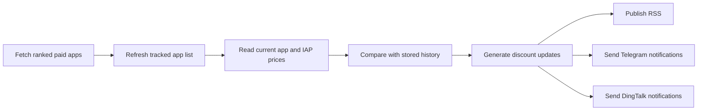

  
An open-source App Store discount tracker built on GitHub Actions, with RSS, Telegram, and DingTalk notifications

  English | [简体中文](https://github.com/appstore-discounts/appstore-discounts/blob/main/README_zh-CN.md)

  
  

# App Store Discounts

Track discounted paid apps and in-app purchases across multiple App Store regions, then receive updates through RSS, Telegram, or DingTalk.

## Why It Exists

App prices change often, and checking them manually is tedious. This project watches ranked paid apps, detects discounts automatically, and publishes updates for the regions you care about.

## What It Supports

- Multiple App Store countries and regions
- Paid app and in-app purchase price tracking
- RSS feeds
- Telegram notifications
- DingTalk notifications
- Automatic refresh through GitHub Actions

## Subscribe

### RSS

| Code | Country or Region | Feed |
| --- | --- | --- |
| `cn` | Mainland China | [RSS](https://raw.githubusercontent.com/appstore-discounts/appstore-discounts/main/rss/cn.xml) |
| `hk` | Hong Kong, China | [RSS](https://raw.githubusercontent.com/appstore-discounts/appstore-discounts/main/rss/hk.xml) |
| `mo` | Macao, China | [RSS](https://raw.githubusercontent.com/appstore-discounts/appstore-discounts/main/rss/mo.xml) |
| `tw` | Taiwan, China | [RSS](https://raw.githubusercontent.com/appstore-discounts/appstore-discounts/main/rss/tw.xml) |
| `us` | United States | [RSS](https://raw.githubusercontent.com/appstore-discounts/appstore-discounts/main/rss/us.xml) |
| `tr` | Türkiye | [RSS](https://raw.githubusercontent.com/appstore-discounts/appstore-discounts/main/rss/tr.xml) |
| `pt` | Portugal | [RSS](https://raw.githubusercontent.com/appstore-discounts/appstore-discounts/main/rss/pt.xml) |

### Telegram

### DingTalk

## How It Works

The workflow runs every `120` minutes:

1. Fetch app information from paid rankings.
2. Refresh the tracked app list.
3. Read the latest app and in-app purchase prices.
4. Compare them with stored history.
5. Generate discount updates.
6. Refresh RSS files and send Telegram / DingTalk notifications.
7. Update related project documents and commit the changes.

Subscribers only receive a push when a tracked app is discounted.

## Related Documents

- [Currently tracked countries, regions, and apps](https://github.com/appstore-discounts/appstore-discounts/blob/main/docs/dist/FOCUS.md)
- [How to contribute](https://github.com/appstore-discounts/appstore-discounts/blob/main/docs/dist/CONTRIBUTION_GUIDELINES.md)

## Star History

<a href="https://star-history.com/#eyelly-wu/appstore-discounts&Date">
  <picture>
    <source media="(prefers-color-scheme: dark)" srcset="https://api.star-history.com/svg?repos=eyelly-wu/appstore-discounts&type=Date&theme=dark"></source><source media="(prefers-color-scheme: light)" srcset="https://api.star-history.com/svg?repos=eyelly-wu/appstore-discounts&type=Date"></source>
  </picture>
</a>

## License

[MIT](./LICENSE)

Copyright (c) 2024-present Eyelly Wu
