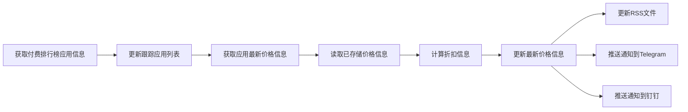

  
开源的 App Store 折扣信息助手，基于 GitHub Actions 实现，支持 RSS，Telegram 和 钉钉 通知

[English](https://github.com/appstore-discounts/appstore-discounts/tree/main#readme) | 简体中文

  
目录

  [愿景](#愿景) 
  [为什么会有这个项目](#为什么会有这个项目) 
  [特性](#特性) 
  [如何订阅](#如何订阅) 
  &emsp;&emsp;[RSS](#rss) 
  &emsp;&emsp;[Telegram](#telegram) 
  &emsp;&emsp;[钉钉](#钉钉) 
  [运行机制及流程](#运行机制及流程) 
  [相关文档](#相关文档) 
  [Star History](#star-history) 
  [License](#license) 

# 愿景
成为 `App Store` 用户信赖的省钱助手，让更多人都能以优惠的价格购买到自己喜欢的应用
# 为什么会有这个项目
App 价格经常变化，手动检查既繁琐也容易错过优惠。本项目会自动追踪付费榜单与已收录应用的价格变化，并通过订阅渠道推送折扣信息，帮助用户更及时地发现值得购买的应用。
# 特性

* 支持任意 `国家或地区` 的 `App Store` （理论上🤔）
* 可追踪 `应用本体` 及 `App 内购买项目` 价格
* 多种订阅方式
   * RSS
   * Telegram
   * 钉钉
* 自动根据付费排行榜更新跟踪应用
* 自动根据优惠频次禁用追踪应用的推送
* 开源免费，欢迎贡献

# 如何订阅

> 友情提示:  
> 通过 `RSS` 和 `Telegram` 订阅需要科学上网才能有好的体验，[了解如何科学上网](https://github.com/eyelly-wu/vpn)
    
## RSS

|编码|国家或地区|RSS 源|
|:-|:-|:-|
|cn|中国大陆|https://raw.githubusercontent.com/appstore-discounts/appstore-discounts/main/rss/cn.xml|
|hk|中国香港|https://raw.githubusercontent.com/appstore-discounts/appstore-discounts/main/rss/hk.xml|
|mo|中国澳门|https://raw.githubusercontent.com/appstore-discounts/appstore-discounts/main/rss/mo.xml|
|tw|中国台湾|https://raw.githubusercontent.com/appstore-discounts/appstore-discounts/main/rss/tw.xml|
|us|美国|https://raw.githubusercontent.com/appstore-discounts/appstore-discounts/main/rss/us.xml|
|tr|土耳其|https://raw.githubusercontent.com/appstore-discounts/appstore-discounts/main/rss/tr.xml|
|pt|葡萄牙|https://raw.githubusercontent.com/appstore-discounts/appstore-discounts/main/rss/pt.xml|

## Telegram
点击  订阅
## 钉钉
点击  订阅
# 运行机制及流程
本项目基于 `GitHub Actions` 定时任务（每 `120` 分钟）自动执行以下流程：

1. 获取付费排行榜应用信息
2. 更新跟踪应用列表
3. 获取应用最新价格信息
   1. 通过 [iTunes Search API](https://developer.apple.com/library/archive/documentation/AudioVideo/Conceptual/iTuneSearchAPI/Searching.html#//apple_ref/doc/uid/TP40017632-CH5-SW1) 获取应用详细信息和 `应用本体` 的价格
   2. 解析应用详情链接获取 `App 内购买项目` 的价格
4. 读取已存储价格信息
5. 计算折扣信息
6. 更新最新价格信息
7. 更新 `RSS` 文件
8. 推送通知到 `Telegram` 
9. 推送通知到 `钉钉` 
10. 标记需要禁用推送的应用
11. 更新 `README.md` 及相关文档
12. 提交 `Git` 更新

如有折扣，订阅用户将收到推送
# 相关文档

* [❤️ 当前追踪的 `国家或地区` 和对应的应用列表](https://github.com/appstore-discounts/appstore-discounts/blob/main/docs/dist/FOCUS_zh-CN.md)
* [🤝 如何参与贡献](https://github.com/appstore-discounts/appstore-discounts/blob/main/docs/dist/CONTRIBUTION_GUIDELINES_zh-CN.md)

# Star History
<a href="https://star-history.com/#eyelly-wu/appstore-discounts&Date">
  <picture>
    <source media="(prefers-color-scheme: dark)" srcset="https://api.star-history.com/svg?repos=eyelly-wu/appstore-discounts&type=Date&theme=dark"></source><source media="(prefers-color-scheme: light)" srcset="https://api.star-history.com/svg?repos=eyelly-wu/appstore-discounts&type=Date"></source>
  </picture>
</a>

# License
[MIT](./LICENSE)

Copyright (c) 2024-present Eyelly Wu